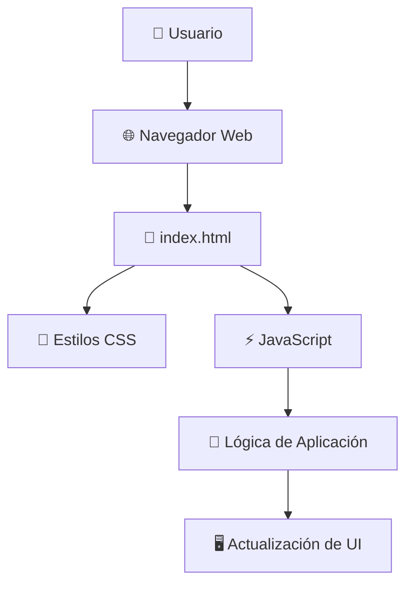

# 🎮 DevFestIca25-Activity2

## 📋 Descripción

Proyecto desarrollado como parte del **DevFest Ica 2025 - Actividad 2**. Esta aplicación web interactiva fue creada durante el evento organizado por Google Developer Groups (GDG).

## ✨ Características Principales

- 🌐 Aplicación web interactiva
- 📱 Diseño responsivo
- 🎨 Interfaz de usuario intuitiva
- ⚡ Desarrollo con tecnologías web modernas

## 🛠️ Tecnologías Utilizadas

| Tecnología | Descripción |
|------------|-------------|
|  | Estructura del documento |
|  | Estilos y diseño visual |
|  | Lógica e interactividad |
|  | Entorno de ejecución |

## 📁 Estructura del Proyecto

```
DevFestIca25-Activity2/
├── 📄 index.html      # Página principal de la aplicación
├── 📦 package.json    # Configuración y dependencias del proyecto
├── 📖 README.md       # Documentación del proyecto
└── 🔒 .gitignore      # Archivos ignorados por Git
```

## 🚀 Instalación y Uso

### Requisitos Previos

- **Node.js** (versión 14 o superior)
- **npm** (incluido con Node.js)
- Un navegador web moderno

### Pasos de Instalación

1. **Clonar el repositorio:**
   ```bash
   git clone https://github.com/Dav082004/DevFestIca25-Activity2.git
   ```

2. **Navegar al directorio del proyecto:**
   ```bash
   cd DevFestIca25-Activity2
   ```

3. **Instalar dependencias:**
   ```bash
   npm install
   ```

4. **Iniciar la aplicación:**
   ```bash
   npm start
   ```

5. **Abrir en el navegador:**
   - Visita `http://localhost:3000` o
   - Abre directamente `index.html` en tu navegador

## 🏗️ Arquitectura de la Aplicación



## 🎯 Cómo Usar

1. Abre la aplicación en tu navegador web
2. Interactúa con la interfaz de usuario
3. Sigue las instrucciones en pantalla
4. ¡Disfruta de la experiencia!

## 🤝 Contribución

Las contribuciones son bienvenidas. Para contribuir:

1. **Fork** - Haz fork del repositorio
2. **Branch** - Crea una rama para tu feature
   ```bash
   git checkout -b feature/nueva-caracteristica
   ```
3. **Commit** - Realiza tus cambios
   ```bash
   git commit -m 'Añadir nueva característica'
   ```
4. **Push** - Sube tu rama
   ```bash
   git push origin feature/nueva-caracteristica
   ```
5. **Pull Request** - Abre un PR para revisión

### Guía de Estilo

- Usa nombres de variables descriptivos
- Comenta el código cuando sea necesario
- Sigue las convenciones de código del proyecto
- Incluye pruebas para nuevas funcionalidades

## 📄 Licencia

Este proyecto está bajo la Licencia MIT. Ver el archivo `LICENSE` para más detalles.

## 👨‍💻 Autor

**Dav082004**

[](https://github.com/Dav082004)

## 🙏 Agradecimientos

- 🎉 **DevFest Ica 2025** por la oportunidad de participar
- 🌟 **Google Developer Groups (GDG)** por organizar el evento
- 👥 Todos los **participantes y mentores** del evento
- 💻 La **comunidad de desarrolladores** por su apoyo continuo

## 📞 Contacto

Si tienes preguntas o sugerencias, no dudes en:

- Abrir un [Issue](https://github.com/Dav082004/DevFestIca25-Activity2/issues)
- Crear un [Pull Request](https://github.com/Dav082004/DevFestIca25-Activity2/pulls)

---

<p align="center">
  
  <br>
  Desarrollado para <strong>DevFest Ica 2025</strong>
</p>